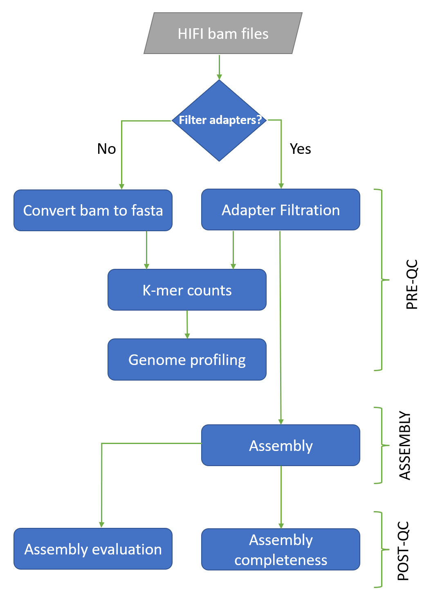

## Description

HiFi-assembly-workflow is a bioinformatics pipeline that can be used to analyse Pacbio CCS reads for *de novo* genome assembly using PacBio Circular Consensus Sequencing (CCS)  reads. This workflow is implemented in Nextflow and has 3 major sections. 
 
Please refer to the following documentation for detailed description of each workflow section:
 
- [Adapter filteration and Pre-assembly quality control (QC)](https://github.com/AusARG/hifi-assembly-workflow/blob/master/recommendations.md#stage-1-adapter-filteration-and-pre-assembly-quality-control)
- [Assembly](https://github.com/AusARG/hifi-assembly-workflow/blob/master/recommendations.md#stage-2-assembly)
- [Post-assembly QC](https://github.com/AusARG/hifi-assembly-workflow/blob/master/recommendations.md#stage-3-post-assembly-quality-control)


## How-to cite this workflow

> citation goes here


## Diagram



## User guide


### Quick start guide

The pipeline has been tested on NCI Gadi, Setonix Pawsey, AWS and AGRF balder cluster. If needed to run on AGRF cluster, please contact us at bioinformatics@agrf.org.au.

**Please note:**

- For running this on NCI Gadi you need access. Please refer to Gadi guidelines for account creation and usage: these can be found at https://opus.nci.org.au/display/Help/Access.
- For running this on Setonix Pawsey you need access. Please refer to Setonix guidelines at https://support.pawsey.org.au/documentation/display/US/User+Support+Documentation.
- That you can either run jobs interactively or submit jobs to the cluster. This is determined by the -profile flag. By passing the if89/setonix tag to the profile argument, the jobs are submitted and run on the cluster and utilising singularity containers.

Support to access compute infrastructure, please refer to ABLeS documentation at https://australianbiocommons.github.io/ables/.


### Required (minimum) inputs/parameters
 
PATH to HiFi bam folder is the minimum requirement for the pipeline.


### Parameters

The workflow accepts the following arguments:
**Mandatory arguments:**

+ `--bam_folder`: Folder containing BAM files (Only *HiFi* BAM file)

**Optional arguments:**

+ `--out_dir`:                   Path to the otuput directory. Default: The input bam directory.
+ `--samtools_threads`:          Number of threads to use for samtools. Default is 8.
+ `--samtools_memory`:           Memory to use for samtools. Default is 16.G.
+ `--adapter_filteration`:       Apply adapter Filtration on the bam files. Default is false.
+ `--hifi_adapter_threads`:      Number of threads used by hifi_adapter. Default is 16.
+ `--hifi_adapter_memory`:       The memory to use for hifi_adapter. Default is 24.
+ `--jellyfish_mer_len`:         The mer length for jellyfish. Default is 21.
+ `--jellyfish_threads`:         The number of threads used by jellyfish. Default is 20.
+ `--jellyfish_hash_size`:       The hash size used by jellyfish. Default is 1G.
+ `--jellyfish_memory`:          The memory used by jellyfish. Default is 24.G.
+ `--genomescope_threads`:       The number of threads used by genome-cope. Default is 1.
+ `--genomescope_memory`:        The memory used by genomescope. Default is 24.G.
+ `--ipa_jobs`:                  Number of jobs used by ipa. Default is 4.
+ `--ipa_threads`:               Number of CPU to run ipa. Default is 8. The number of the requested cpus will `ipa_jobs * ipa_threads`.
+ `--ipa_memory`:                The memory used by ipa. Default is 32.G.
+ `--quast_threads`:             The number of threads used by quast. Default is 32.
+ `--quast_memory`:              The memory used by quast. Default is 24.G.
+ `--busco_lineage_dir`:         The path to busco database. if not provided or set to [] busco will download the lineage. default on if89 profile is Default on `if89` is `/g/data/if89/data_library/busco_db/14082023/`.
+ `--busco_lineage`:             The lineage to use from the busco database. default is `eukaryota`.
+ `--busco_threads`:             The number of threads used by busco. Default is 32.
+ `--busco_memory`:              The memory requested for busco. Default is ${params.busco_memory}.
+ `--project_id`:                Project id on GADI to submit jobs through. Mandatory when using if89 profile. (Example: xl04 for AusARG).
+ `--storage_paths`:             Storage_paths on GADI to to be accessed from the compute nodes. Mandatory when using if89 profile. (Example: gdata/if89+gdata/xl04).
+ `--singularity_cache`:         The path to the singularity local cache directory. Default on `if89` is `/g/data/if89/singularity_cache/`

+ `--aws_execution_role`:        The execution role to be used when running the pipline using aws batch on AWS cloud service. Mandatory when using `aws` profile. 
+ `--aws_region`:                The AWS region needed for configuring running the pipline using aws batch on AWS cloud service. Mandatory when using `aws` profile.
+ `--aws_queue`:                 The AWS batch queue to submit the jobs to. Mandatory when using `aws` profile.

**Nextflow arguments:**
+ `-profile`: execution profiles. `if89`/`balder`/`local`/`setonix`/`aws`/`singularity`/`docker`/


### Third party tools / dependencies

The following packages are used by the pipeline.

- `nextflow/21.04.3`
- `samtools/1.12`
- `jellyfish/2.3.0`
- `genomescope/2.0`
- `ipa/1.3.1`
- `quast/5.0.2`
- `busco/5.4.3`
- `HiFiAdapterFilt/2.0.0`

The following paths contain all modules required for the pipeline.

- `/apps/Modules/modulefiles`
- `/g/data/if89/apps/modulefiles/`


## Infrastructure usage and recommendations

### Pawsey

#### Running on Setonix at Pawsey
```
module load nextflow/23.04.1
module load singularity/3.8.6
nextflow run hifi_assembly.nf --bam_folder <PATH TO THE BAM FOLDER> --project_id director2172  -profile setonix
```


### NCI 

#### Facility access

One should have a user account set with NCI to access gadi high performance computational facility. Setting up a NCI account is mentioned in detail at the following URL: https://opus.nci.org.au/display/Help/Setting+up+your+NCI+Account 
  
Documentation for a specific infrastructure should go into a infrastructure documentation template
https://github.com/AustralianBioCommons/doc_guidelines/blob/master/infrastructure_optimisation.md


#### Running on GADI at NCI

Here is an example that can be used to run a phased assembly on Gadi utilising [if89](https://australianbiocommons.github.io/ables/if89/) (shared tools and workflow repository):

```
module load nextflow
module load singularity
nextflow run hifi_assembly.nf --bam_folder <PATH TO THE BAM FOLDER> --project_id xl04 --storage_paths gdata/if89+gdata/ll61 -profile if89
```


#### Example local profile usage

```
Start a screen, submit a job, and run the workflow 
Screen -S ‘name’
qsub -I -qnormal -Pwz54 -lwalltime=48:00:00,ncpus=4,mem=200GB,storage=scratch/wz54+gdata/wz54,wd
export MODULEPATH=/apps/Modules/modulefiles:/g/data/wz54/groupResources/modules
module load nextflow/21.04.3
nextflow run /g/data/wz54/groupResources/scripts/pl/hifi_assembly.nf  --bam_folder  <bam-folder_path> -profile local
This load the scripts directory to the environmental PATH and load nextflow module
module load hifi_assembly/1.0.0 
```

### Outputs

Pipeline generates various files and folders here is a brief description: 
The pipeline creates a folder called `secondary_analysis` that contains two sub folders named:

- `exeReport`     
- `Results`       -- Contains preQC, assembly and postQC analysis files

#### exeReport
This folder contains a computation resource usage summary in various charts and a text file. 
`report.html` provides a comprehensive summary.

#### Results
The `Results` folder contains three sub-directories preQC, assembly and postqc. As the name suggests, outputs from the respective workflow sections are placed in each of these folders.

##### preQC
The following table contains list of files and folder from preQC results

| Output folder/file | File             | Description                                                                    |
| ------------------ | ---------------- | ------------------------------------------------------------------------------ |
| <sample>.fa        |                  | Bam files converted to fasta format                                            |
| kmer\_analysis     |                  | Folder containing kmer analysis outputs                                        |
|                    | <sample>.jf      | k-mer counts from each sample                                                  |
|                    | <sample>.histo   | histogram of k-mer occurrence                                                  |
| genome\_profiling  |                  | genomescope profiling outputs                                                  |
|                    | summary.txt      | Summary metrics of genome scope outputs                                        |
|                    | linear\_plot.png | Plot showing no. of times a k-mer observed by no. of k-mers with that coverage |

##### Assembly

This folder contains final assembly results in <FASTA> format.

- `<sample>_primary.fa` - Fasta file containing primary contigs
- `<sample>_associate.fa` - Fasta file containing associated contigs

##### postqc
 
The postqc folder contains two sub folders 

- `assembly_completeness`
- `assembly_evaluation`

###### assembly_completeness
This contains BUSCO evaluation results for primary and associate contig.

###### assembly_evaluation

Assembly evaluation folder contains various file formats, here is a brief description for each of the outputs.

| File        | Description                                                                               |
| ----------- | ----------------------------------------------------------------------------------------- |
| report.txt  | Assessment summary in plain text format                                                   |
| report.tsv  | Tab-separated version of the summary, suitable for spreadsheets (Google Docs, Excel, etc) |
| report.tex  | LaTeX version of the summary                                                              |
| icarus.html | Icarus main menu with links to interactive viewers                                        |
| report.html | HTML version of the report with interactive plots inside                                  |


## Compute resource usage across tested infrastructures

|                                       | Computational resource for plant case study |
| ------------------------------------- | ------------------------------------------- |
|                                       | Time                                        | CPU | Memory | I/O |
| Process                               | realtime                                   | realtime | %cpu | peak\_rss | peak\_vmem | rchar | wchar |
| Converting bam to fasta for sample    | 12m 48s                                     | 12m 48s | 99.80% | 5.2 MB | 197.7 MB | 43.3 GB | 50.1 GB |
| Generating k-mer counts and histogram | 26m 36s                                     | 26m 36s | 1725.30% | 19.5 GB | 21 GB | 77.2 GB | 27.1 GB |
| Profiling genome characteristics      | 13.2s                                       | 13.2s | 89.00% | 135 MB | 601.2 MB | 8.5 MB | 845.9 KB |
| Denovo assembly                       | 6h 51m 11s                                  | 6h 51m 11s | 4744.40% | 84.7 GB | 225.6 GB | 1.4 TB | 456 GB |
| evaluate\_assemblies                  | 4m 54s                                      | 4m 54s | 98.20% | 1.6 GB | 1.9 GB | 13.6 GB | 2.8 GB |
| assemblies\_completeness              | 25m 53s                                     | 25m 53s | 2624.20% | 22 GB | 25.2 GB | 624.9 GB | 2.9 GB |


|                                       | Computational resource for bird case study |
| ------------------------------------- | ------------------------------------------ |
|                                       | Time                                       | CPU | Memory | I/O |
| Process                               | realtime                                   | realtime | %cpu | peak\_rss | peak\_vmem | rchar | wchar |
| Converting bam to fasta for sample    | 7m 9s                                    | 7m 9s | 86.40% | 5.2 MB | 197.8 MB | 21.5 GB | 27.4 GB |
| Generating k-mer counts and histogram | 15m 34s                                    | 15m 34s | 1687.70% | 10.1 GB | 11.7 GB | 44 GB | 16.6 GB |
| Profiling genome characteristics      | 1m 15s                                      | 1m 15s | 15.30% | 181.7 MB | 562.2 MB | 8.5 MB | 819.1 KB |
| De novo assembly                      | 9h 2m 47s                                 | 9h 2m 47s | 1853.50% | 67.3 GB | 98.4 GB | 1 TB | 395.6 GB |
| evaluate assemblies                   | 2m 48s                                     | 2m 48s | 97.50% | 1.1 GB | 1.4 GB | 8.7 GB | 1.8 GB |
| assemblies completeness               | 22m 36s                                    | 22m 36s | 2144.00% | 22.2 GB | 25 GB | 389.7 GB | 1.4 GB |

  
## Benchmarking
  
N/A


## Additional notes


## Help/FAQ/Troubleshooting

Direct training and help is available if you are new to HPC and/or new to NCI/Gadi.

- Basic information to get started with the NCI Gadi for bioinformatics can be found at https://github.com/AusARG/ABLeS/wiki/temppage.
- For NCI support, contact the NCI helpdesk directly at https://www.nci.org.au/users/nci-helpdesk
- Queue limits and structure explained at https://opus.nci.org.au/display/Help/4.+PBS+Jobs


## 3rd party Tutorials 

A tutorial by Andrew Severin on running GenomeScope 1.0 is available here:
https://github.com/AusARG/hifi-assembly-workflow.git

Improved Phased Assembler tutorial is available at 
https://github.com/PacificBiosciences/pbbioconda/wiki/Improved-Phased-Assembler

Busco tutorial
https://wurmlab.com/genomicscourse/2016-SIB/practicals/busco/busco_tutorial


## Licence(s)

MIT License

Copyright (c) 2022 AusARG

Permission is hereby granted, free of charge, to any person obtaining a copy
of this software and associated documentation files (the "Software"), to deal
in the Software without restriction, including without limitation the rights
to use, copy, modify, merge, publish, distribute, sublicense, and/or sell
copies of the Software, and to permit persons to whom the Software is
furnished to do so, subject to the following conditions:

The above copyright notice and this permission notice shall be included in all
copies or substantial portions of the Software.

THE SOFTWARE IS PROVIDED "AS IS", WITHOUT WARRANTY OF ANY KIND, EXPRESS OR
IMPLIED, INCLUDING BUT NOT LIMITED TO THE WARRANTIES OF MERCHANTABILITY,
FITNESS FOR A PARTICULAR PURPOSE AND NONINFRINGEMENT. IN NO EVENT SHALL THE
AUTHORS OR COPYRIGHT HOLDERS BE LIABLE FOR ANY CLAIM, DAMAGES OR OTHER
LIABILITY, WHETHER IN AN ACTION OF CONTRACT, TORT OR OTHERWISE, ARISING FROM,
OUT OF OR IN CONNECTION WITH THE SOFTWARE OR THE USE OR OTHER DEALINGS IN THE
SOFTWARE.


## Acknowledgements/citations/credits

> Jung, H. et al. Twelve quick steps for genome assembly and annotation in the classroom. PLoS Comput. Biol. 16, 1–25 (2020).

> 2020, G. A. W. No Title. https://ucdavis-bioinformatics-training.github.io/2020-Genome_Assembly_Workshop/kmers/kmers.

> Sović, I. et al. Improved Phased Assembly using HiFi Data. (2020).

> Gurevich, A., Saveliev, V., Vyahhi, N. & Tesler, G. QUAST: Quality assessment tool for genome assemblies. Bioinformatics 29, 1072–1075 (2013).

> Waterhouse, R. M. et al. BUSCO applications from quality assessments to gene prediction and phylogenomics. Mol. Biol. Evol. 35, 543–548 (2018).
